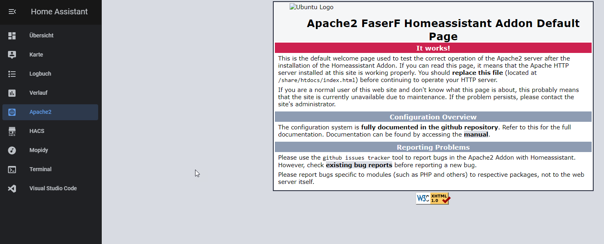

# Home Assistant Community Add-on: Apache2
![Supports aarch64 Architecture][aarch64-shield] ![Supports amd64 Architecture][amd64-shield] ![Supports armhf Architecture][armhf-shield] ![Supports armv7 Architecture][armv7-shield] ![Supports i386 Architecture][i386-shield]
![Project Maintenance][maintenance-shield]

Apache2 Webserver for Homeassistant OS



## About
  
This addon makes a LAMP stack (Linux Apache Mysql Php) available to the HassOS operating system for
advanced web server deployment.

After (or before) installing this addon the following addons need to be installed:
  MariaDB addon (from this (JohnC) repository)
  phpMyAdmin addon

This docker image comes with: apache2, apache2-mariadb, apache2-php7.3.18, apache2-ssl

## Installation

The installation of this add-on is pretty straightforward and not different in comparison to installing any other custom Home Assistant add-on.
Just add my repo to the hassio addons repositorys: https://github.com/jcerullo/hassio-addons

The tennis website files are located in /share/htdocs
Example File where your index.html should be: /share/htdocs/index.html

If you want to integrate your website with a mariadb database, please ensure that the MariaDB Addon is installed!

## Configuration

**Note**: _Remember to restart the add-on when the configuration is changed._

Example add-on configuration:

```yaml
document_root: /share/htdocs
php_ini: /share/php.ini
default_conf: /share/000-default.conf
default_ssl_conf: /share/000-default-le-ssl.conf
website_name: https://mydomain.duckdns.org:8123
ssl: true
certfile: fullchain.pem
keyfile: privkey.pem
```

**Note**: _This is just an example, don't copy and paste it! Create your own!_

### Option: `document_root`

This option is needed. Change it depending where your root webfolder is on your homeassistant installation.

Note: it has to be somewhere in the /share or /media folder! Other folders are not visible to this addon.

### Option: `php_ini`

You can choose between the following options:

default -> the default php7 php.ini file will be used

get_file -> copies the default php7 php.ini file from the addon to /share/apache2addon_php.ini

path/to/your/new/php.ini -> Please change the location depending where your custom php.ini file is, f.e.: /share/apache2/php.ini

### Option: `default_conf` & `default_ssl_conf`

You can choose between the following options:

default -> the default apache2 addon file will be used

path/to/your/new/php.ini -> Please change the location depending where your custom 000-default.conf / 000-default-le-ssl.conf file is, f.e.: /share/apache2/000-default.conf  /// More Information: https://cwiki.apache.org/confluence/display/HTTPD/ExampleVhosts

Please note, that I wont give any support if you are using custom apache2 config files and are recieving any apache2 errors!

### Option: `website_name`

This option is needed, if you enable ssl to true. If you are not using SSL put anything in here, as it doesnt matter.

### Option: `ssl`

Enables/Disables SSL (HTTPS) on the web interface of Bookstack
Panel. Set it `true` to enable it, `false` otherwise.

If you need a self-signed certificate, have a look at my openssl addon: https://github.com/jcerullo/hassio-addons/openssl

**Note**: _The files MUST be stored in `/ssl/`, which is the default_

## Ingress

This addon supports Homeassistant Ingress. Until now it seems only to work if you enable SSL!
And also I am sorry, but I cant support all your websites. Basic HTML Websites will work great with ingress, the more advanced the page is, the harder it is to support ingress.

## Support

Got questions?

You could [open an issue here][issue] GitHub.
This software was tested on a RPi3b+ running HassOS.

## Authors & contributors

The original program is from the Apache Project. For more informatios please visit this page: https://httpd.apache.org/
The hassio addon is brought to you by [FaserF] who did all of the heavy lifting.  [JohnC] added a few tweeks for session 
variable support and external DB support.

## License

MIT License

Copyright (c) 2019-2020 FaserF/JohnC & The Apache Project

Permission is hereby granted, free of charge, to any person obtaining a copy
of this software and associated documentation files (the "Software"), to deal
in the Software without restriction, including without limitation the rights
to use, copy, modify, merge, publish, distribute, sublicense, and/or sell
copies of the Software, and to permit persons to whom the Software is
furnished to do so, subject to the following conditions:

The above copyright notice and this permission notice shall be included in all
copies or substantial portions of the Software.

THE SOFTWARE IS PROVIDED "AS IS", WITHOUT WARRANTY OF ANY KIND, EXPRESS OR
IMPLIED, INCLUDING BUT NOT LIMITED TO THE WARRANTIES OF MERCHANTABILITY,
FITNESS FOR A PARTICULAR PURPOSE AND NONINFRINGEMENT. IN NO EVENT SHALL THE
AUTHORS OR COPYRIGHT HOLDERS BE LIABLE FOR ANY CLAIM, DAMAGES OR OTHER
LIABILITY, WHETHER IN AN ACTION OF CONTRACT, TORT OR OTHERWISE, ARISING FROM,
OUT OF OR IN CONNECTION WITH THE SOFTWARE OR THE USE OR OTHER DEALINGS IN THE
SOFTWARE.

[aarch64-shield]: https://img.shields.io/badge/aarch64-yes-green.svg
[amd64-shield]: https://img.shields.io/badge/amd64-yes-green.svg
[armhf-shield]: https://img.shields.io/badge/armhf-yes-green.svg
[armv7-shield]: https://img.shields.io/badge/armv7-yes-green.svg
[commits]: https://github.com/FaserF/apache2/commits/master
[contributors]: https://github.com/FaserF/hassio-addons/apache2/graphs/contributors
[FaserF]: https://github.com/FaserF/
[i386-shield]: https://img.shields.io/badge/i386-yes-green.svg
[issue]: https://github.com/FaserF/hassio-addons/issues
[repository]: https://github.com/FaserF/hassio-addons/apache2
[maintenance-shield]: https://img.shields.io/maintenance/yes/2020.svg
